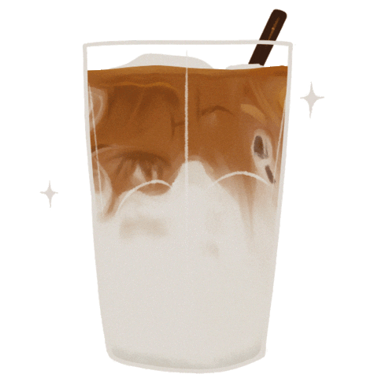
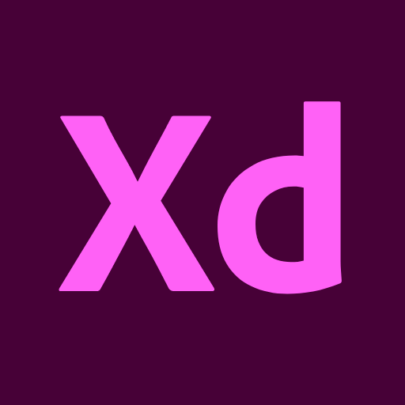

  <h1 align="center"><b>Hi, I'm Latte</b> </h1>

 

  &nbsp;
  &nbsp;

## About me:
- 🐳 I'm an enthusiastic frontend developer
- 🍨 I’m interested in making websites beautiful, functional, and accessible
- 🧶 I’m currently learning ReactJS and UX design

 

## My projects:

 

## Languages & tools:

&nbsp;

 

 

## Reach me out:

